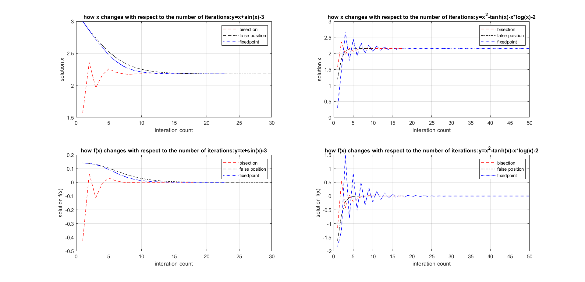
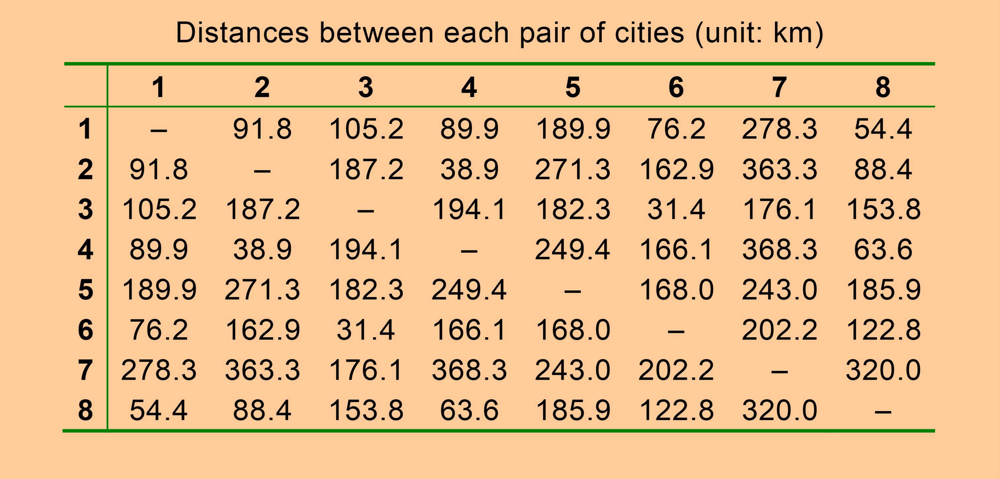
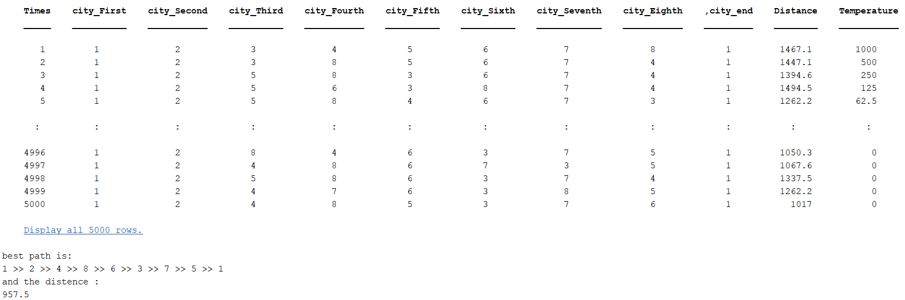
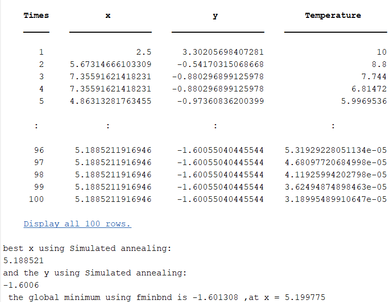
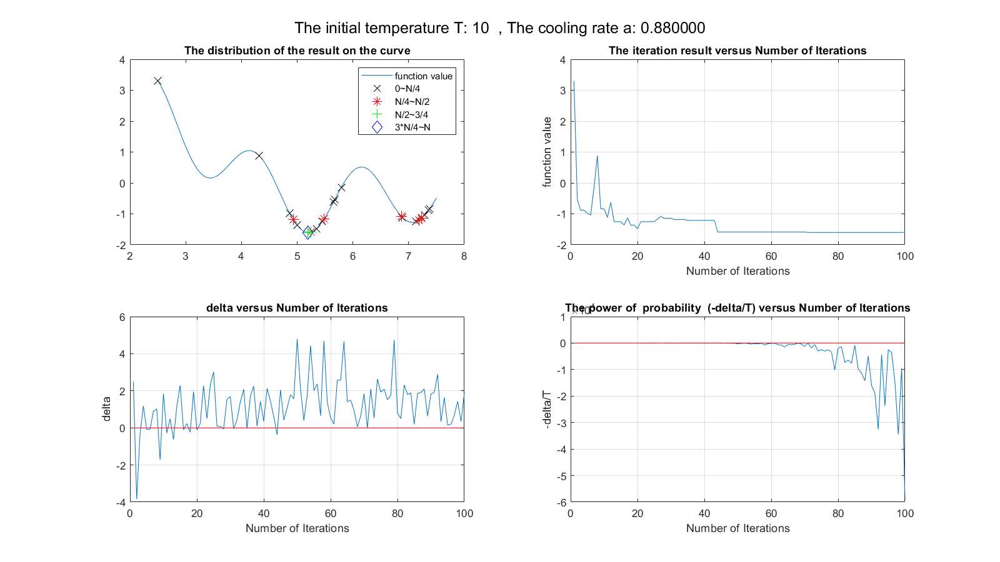
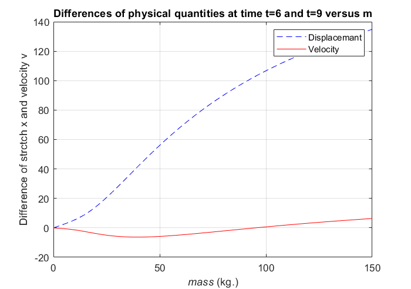
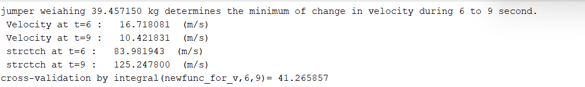

# NYUST_EE_Numerical Methods
## Course Introduction
Numerical methods refer to mathematical approaches that are often implemented with computer programs to solve engineering or scientific problems. Various fields adopt numerical methods such as regression analysis of data trending and predictions, assessments of physical characteristics of circuits, and torque required for electric motor control, to name a few. Such methods deal with problems of certain complexity by coming up with approximate solutions, especially when exact solutions can hardly be obtained or cannot be represented in rational numbers. The main gist of this course is to familiarize students with the methodology of finding, under a certain amount of processing time, approximate solutions within reasonable errors of estimation.    

## NM2  
Apply the bisection, false position, and simple fixedpoint iteration methods to solve equations,and Display the root and the number of iterations of each method for comparison
- $\ x-sin(x)-3=0$  
- $\ x^2-tanh(x)-x*ln(x)-2=0$  

## NM 3
Write a MATLAB program that adopts the simulated annealing strategy to solve the travelling salesman problem.  

## NM5
### 1. Develop MATLAB code that implements simulated annealing to find the global minimum of $f(x)=\sin(x)+\sin\left(\frac{10x}{3}\right)+\ln(x)-0.84x+3$ , where  $\ 2.7<=x<=7.5 $  

The picture below shows the results of each iteration and the best solution, and is verified by the fminbnd.  

  

The picture below:  
1. From this figure, we can know the distribution of the results obtained by the simulated annealing method in the iteration range .  
2. The iteration result versus Number of Iterations.  
3. The difference between the current result and the previous result: We can use the information obtained from this figure to adjust the parameters of the simulated annealing method.  
4. The power of  probability  (-delta/T) versus Number of Iterations.  

  

Conclusion : The choice of initial temperature affects the number of times a poor solution is accepted early in an iteration,the cooldown rate affects the behavior later in the iteration.If you want to make the answer more accurate, then increasing the number of iterations(But the time consumed will increase) will be one of your considerations. In addition, the simulated annealing method also needs to know the details of the target problem before applying it, so that it is convenient to choose its parameters.  

### 2.Consider  a bungee-jumper problem modeled as an equation  $m \frac{d^2 x}{dt^2}=mg - kx- \beta \frac{dx}{dt}$ , where m is the jumper's mass(kg),x is the distance the bungee cord is stetched , t is time (s) , g denotes the acceleration due to gravity ($\ 9.81 m/s^2$), k represents the drag coefficient (kg/m) of a bungee cird ,$ \beta $ is the wind resistant constant. letting k=2.73，$\beta$ = 13.08 and x(0)=x(0)'=0,we are concerned with the motion of jumpers of varying masses during 6 to 9 seconds after leap. Develope MATLAB code to generate aforementioned figure and to find the mass that leads to the minimum value of Velocity.

According to the topic, establish a second-order differential equation in which x is the dependent variable and m and t are the independent variables(Differentiate x with respect to t)，set initial condition  , and  solve this differential equation to find expressions for x and its derivatives.  

The picture expresses that Differences of physical quantities at time t=6 and t=9 versus mass.The weight at the lowest point of the speed difference can be obtained through the calculation formula.Then bring this mass back to the formula on the previous page to obtain the Velocity and Displacemant at different times, and finally verify whether the Displacemant is correct by integrating the Velocity function.  

   